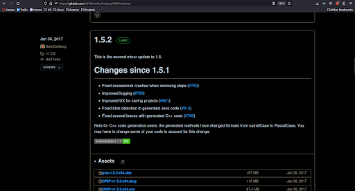
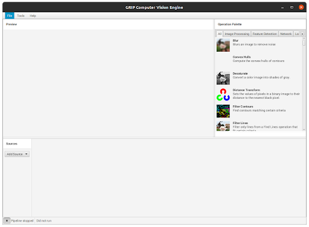
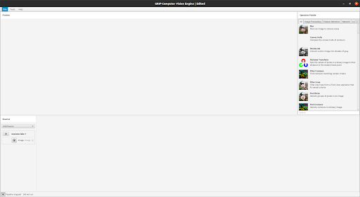
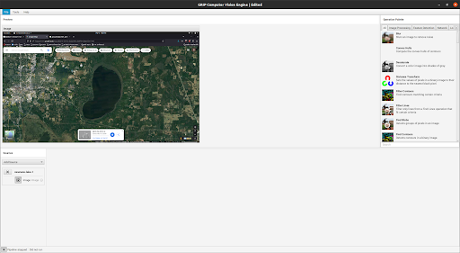
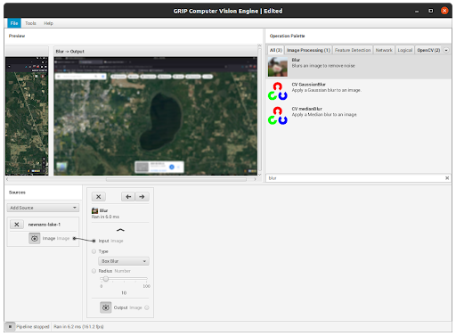
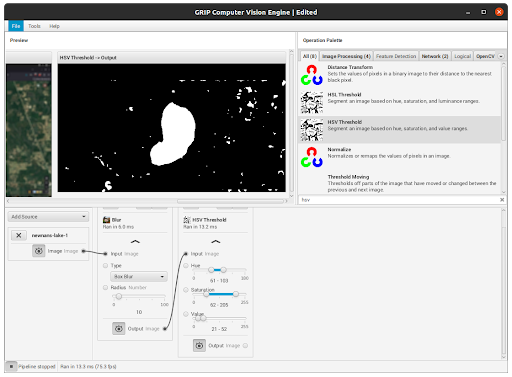
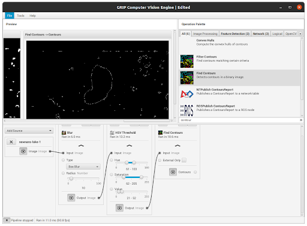
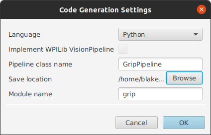

# Grip OpenCV Reference

## Overview

This document provides a reference on how to use the [GRIP](https://wpiroboticsprojects.github.io/GRIP/#/) tool for generating OpenCV pipelines, along with an example relevant to the Bathydrone project.

Note that I used Ubuntu 20.04, Python 3.9.15, and GRIP 1.5.2 on an X86 PC (not a Mac) when working with this tool, so the process may be slightly different on other platforms/operating systems/etc.

Please also note that for my specific setup, I needed to slightly edit the pipeline itself (e.g., changing the number of values received in a function call) in order to make it work for my setup. Be aware of that when troubleshooting. Additionally, you may need to fine-tune the parameter values for your specific application, and thus they may differ from what worked for me.

## Installation

- Locate the latest release [here](https://github.com/WPIRoboticsProjects/GRIP/releases). (Note that later releases may be marked as pre-releases. Consider scrolling down till you find one marked as a release. See figure below for reference.)

- Find the appropriate download in “Assets” for your system type and operating system. Mine was the -x64.deb (64-bit AMD/Intel Processor on a Debian-based distribution, such as Ubuntu) at the top of the list.

- Download the file and begin installation. In my case, I installed it using dpkg (Debian package manager) via the following terminal command:

	sudo dpkg -i ~/Downloads/grip-1.5.2-x64.deb

- I then searched for the executable in the GUI (Windows+S hotkey by default; type “grip” into the search bar) and selecting it.

- We are then greeted with the GRIP interface (see figure in next section).

## Usage

- The “Preview” window in the top left shows the results of each stage of the pipeline when we make them visible (to be explained later). 
- “Operation Palette” shows all possible OpenCV operations, along with a search bar to find them.
- The user can drag and drop operations into the section to the right of “Sources”, where an input (e.g., an image) can be selected.
- When finished, Select “Tools -> Generate Code” (or use Ctrl+G) to begin generating code.

## Creating a Pipeline

OpenCV pipelines sequentially perform operations on an input (such as a video or image) to acquire some output (in our example, a contour–polygon–surrounding a body of water).
- First select an image (“Add Source -> Image(s)”, then navigate to the image file you want to use). You will see it appear in the bottom-left:

- Click the eye icon to make it visible in the Preview window:

- Then begin adding operations to the pipeline. 

For each operation: search for, then click and drag, operations into the bottom-right section of the app. Connect the image source output to the input of the first operation, the output of that operation to the input of the second, and so on.

- We will start with a blur to soften edges. You should see a more blurry version of the original image once you make that step visible in the Preview window:

- Next, an HSV (hue/saturation/value) threshold can be applied to filter for water colors. You should see white pixels for the regions of interest (water bodies in our case):

- Then we will find contours. You should see thin lines surrounding the regions that were marked white in the previous step:

- We can then filter those contours by minimum area (use any parameters as needed for your application, but minimum area was sufficient for my case). You should aim to filter out any region from the previous step that you are not interested in:

The result of this pipeline is a contour, or effectively a list of points, surrounding the water body of interest, which can then be used as needed in the calling code.

## Generating Code

Select Tools -> Generate Code (or press Ctrl+G) to open the below prompt, selecting the appropriate language, save location, and name:

Once it generates, you can exit GRIP. Save your GRIP project if you like.

The pipeline can then be called in another Python script by placing it in the same directory and importing it:

	import grip # replace "grip" with the name of the pipeline file you generated

Example code can be found in the [Bathydrone Project GitHub](https://github.com/andrespulido8/bathydrone/blob/maps_image_processing/maps_image_processing/water_body_demo.py).
