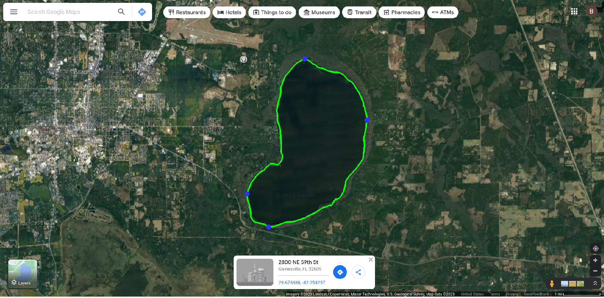

# Water Body Edge Detection
*Blake Sanders - 20 May 2023*

## Overview
This directory contains code for automatically detecting the edges of a body of water using OpenCV. A list of latitude/longitude points that make up a bounding polygon are generated to an output file. Demo material is included, which runs the OpenCV pipeline on [Newnans Lake](https://www.google.com/maps/@29.645077,-82.2348922,13354m/data=!3m1!1e3) Some manual input is required to make the conversion from (x, y) pixel coordinates to latitude and longitude.

## Setup
Note the recommended Python version is *3.9.x*.

After cloning this repository, utilize the `requirements.txt` file located within this directory to install any necessary packages (including OpenCV and others). Consider creating a Python virtual environment using pyenv-virtualenv, conda, or a similar tool when installing these packages.

Type the following command into your terminal to install the required packages in your environment:
```
pip install -r requirements.txt
```
OpenCV and other necessary packages should now be installed.

## Usage
These steps are explained by the tool itself, but are here as well for reference.

1. Run the `water_body_demo.py` script: `python water_body_demo.py`
2. You will be prompted on whether you want to collect latitude/longtitude points for the given body of water. Type `y` (and press Enter twice) to bring up a view of the scanned image, overlaid with the detected water body edge. 

	1. Open Google Maps or a similar tool and locate the body of water being scanned. Then collect the latitudes of the top and bottom points on the body of water, as well as the longitudes of the left and right points (all marked in blue on the image).

	2. Update the file `newnans-lake-bounds.csv` with these new values.
3. Re-run the script and enter a different input (e.g., `n`) to have the script output the results to `newnans-lake-coords`.
