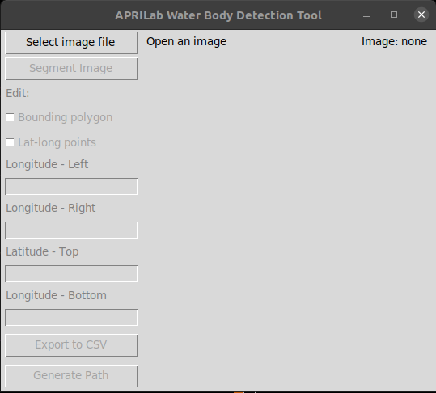

# Segment Anything Testing

Repo for hosting any experiments I do with Meta's Segment Anything model or [FastSAM](https://github.com/CASIA-IVA-Lab/FastSAM).

# Project: APRILab FastSAM UI
Goal: Design a UI to integrate the path planning workflow for the [Bathydrone](https://aprilab.mae.ufl.edu/research/) project.

## Setup and Installation (Ubuntu 20.04):
Clone the repo:
```console
$ git clone https://github.com/BlakeSanders10497/SAM_Testing.git
```

Once you have cloned and entered the repo, it is recommended to create a virtual environment using [venv](https://docs.python.org/3/tutorial/venv.html):
### 1. Install Python and venv
- (Verified on version 3.9. FastSAM relies on 3.7 or later; see https://github.com/CASIA-IVA-Lab/FastSAM#installation for more information.)
```console
$ sudo apt install python3.9
$ sudo apt install python3.9-venv
```
- (Optional): Add an alias for that specific Python version to your .bashrc:
```console
alias python3.9='/usr/bin/python3.9'
```
### 2. Create a virtual environment
- Make sure you use the Python version you just installed when creating the virtualenv!
```console
$ mkdir .venv && cd .venv
$ python3.9 -m venv fastsam-env # replace 'fastsam-env' throughout with name of your choosing
$ source fastsam-env/bin/activate
$ cd .. # back to the root directory of the repo
```
- Verify that the environment is activated before continuing! Your terminal should look like:
```console
(fastsam-env) user@user-host-machine:path/to/installation$ 
# e.g.,
(fastsam-env) blake@blake-laptop-ubu:~/Documents/GitHub/SAM_Testing$
```
- You can also confirm the version of Python (and corresponding version of pip):
```console
$ python --version
Python 3.9.5
$ pip --version
pip 20.0.2 from /home/blake/Documents/GitHub/SAM_Testing/.venv/fastsam-env/lib/python3.9/site-packages/pip (python 3.9)
```
### 3. install required packages
- First install PyTorch and TorchVision [here](https://pytorch.org/get-started/locally/). If you have an NVIDIA GPU, it is highly recommended to install the CUDA versions. Example below:
```console
$ pip3 install torch torchvision torchaudio --index-url https://download.pytorch.org/whl/cu118
```
- Install requirements from the file included in the repo:
```console
$ pip install wheel
$ pip install -r requirements.txt
```
- Install CLIP:
```console
$ pip install git+https://github.com/openai/CLIP.git
```

# Usage
Once finished setting up a virtual environment and installing the necessary packages, the UI can be opened with
```console
$ python april_fastsam_ui.py
```
After a few seconds, the UI should pop up as a separate window:

